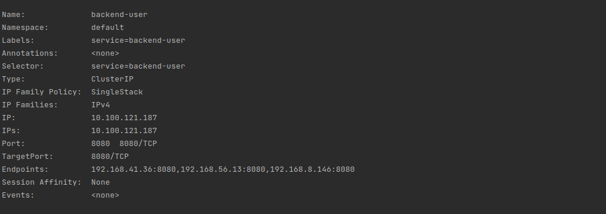
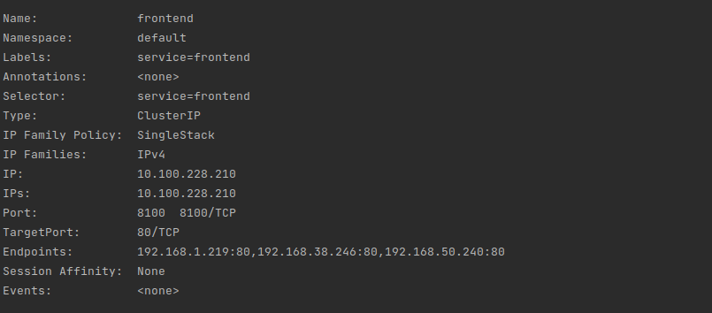
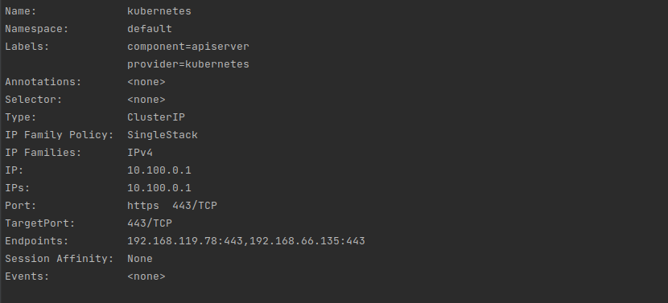
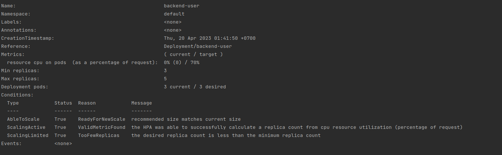
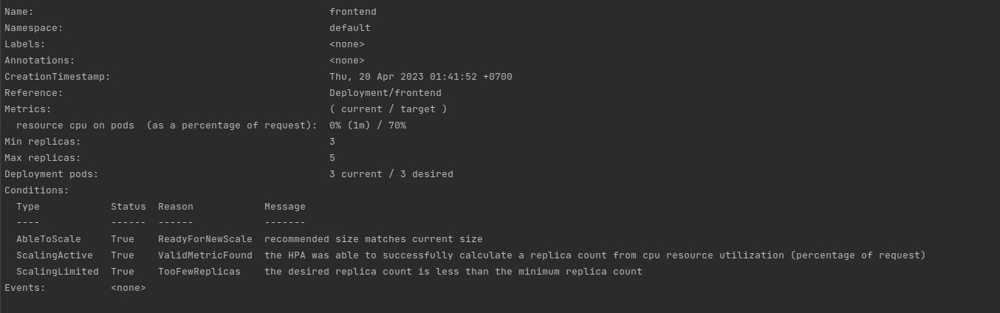
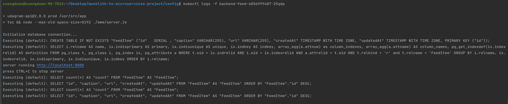

# Screenshots
To help review your infrastructure, please include the following screenshots in this directory::

## Deployment Pipeline
* DockerHub showing containers that you have pushed
  
* GitHub repository’s settings showing your Travis webhook (can be found in Settings - Webhook)
* Travis CI showing a successful build and deploy job
* I use circle ci instead of travis ci for charge fee reason
  
  
  [CircleCI pipeline](https://app.circleci.com/pipelines/github/cuongbrilliantSE/udagram/33/workflows/c1137c87-3ab4-43d0-a0e5-57a8ddb215ee/jobs/39 "Click to view the pipeline")


## Kubernetes
* To verify Kubernetes pods are deployed properly
```bash
kubectl get pods
```
  
* To verify Kubernetes services are properly set up

```bash
kubectl describe services
```
 
 
 
 
 
 
 
* To verify that you have horizontal scaling set against CPU usage
```bash
kubectl describe hpa
```





* To verify that you have set up logging with a backend application
```bash
kubectl logs {pod_name}
```


